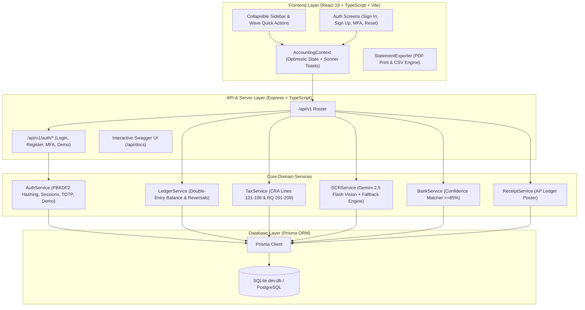

# 🇨🇦 Studio Books — Comprehensive Co-Founder & Technical Deep Dive

> **Practice-First Multi-Client Bookkeeping & Accounting Engine for Canadian CPAs**  
> *Immutable Double-Entry Ledger • CRA & Revenu Québec Compliance • Multimodal AI OCR • Full Authentication & Demo Mode*

---

## 📑 Table of Contents
1. [Executive Summary & Core Differentiators](#1-executive-summary--core-differentiators)
2. [End-to-End System Architecture](#2-end-to-end-system-architecture)
3. [Relational Data Model & Database Schema](#3-relational-data-model--database-schema)
4. [Authentication & Demo Architecture (For Auth Screen Developers)](#4-authentication--demo-architecture-for-auth-screen-developers)
5. [Backend Services & Core Domain Engines](#5-backend-services--core-domain-engines)
6. [Complete REST API Specification](#6-complete-rest-api-specification)
7. [Frontend Architecture, UI & Design Tokens](#7-frontend-architecture-ui--design-tokens)
8. [Current Capability Matrix (Live vs. Simulated)](#8-current-capability-matrix-live-vs-simulated)
9. [5-Minute Co-Founder Interactive Test Walkthrough](#9-5-minute-co-founder-interactive-test-walkthrough)

---

## 1. Executive Summary & Core Differentiators

### The Problem
Generic US-centric bookkeeping platforms (QuickBooks, Wave, FreshBooks, Xero) fail Canadian bookkeeping practices in three critical areas:
1. **Quebec & Complex Sales Tax**: They struggle with Quebec’s dual tax regime (**GST 5% + QST 9.975%**) and the tax-on-tax historical intricacies, forcing bookkeepers into manual calculations.
2. **Practice-First Multi-Tenancy**: Most platforms treat each client as an isolated silo, requiring separate subscriptions and logins rather than a unified practice workspace with staff assignment and batch workflows.
3. **Fiduciary Trust Accounting**: Legal, real estate, and professional service clients require distinct **Operating Chequing (`1010`)** and **Retainer Trust Accounts (`1020`)** with zero overdraft rules.

### Studio Books Solution
Studio Books is engineered specifically for Canadian CPAs and multi-client practices:
- **Immutable Double-Entry Ledger**: Enforces strict mathematical equilibrium ($\sum \text{Debits} \equiv \sum \text{Credits}$). Errors are corrected via CRA-auditable reversing entries (`createReversalJournalEntry`) rather than destructive updates.
- **Multimodal AI OCR (Gemini 2.5 Flash)**: Ingests PDF and image receipts, extracts Canadian subtotal/tax breakdowns, and automatically suggests matching Canadian GL codes.
- **Publication-Ready Financial Statements**: Generates CPA-certified Balance Sheets, P&Ls, Trial Balances, and GL Audit Trails with 1-click PDF/print letterheads and Excel exports.
- **CRA GST34 & Revenu Québec VDZ-471 Automation**: Pre-populates federal Lines (101, 105, 108, 109) and provincial Lines (201, 205, 208, 209).
- **Authentication & Instant Demo Engine**: Supports real user credentials, password resets, and SOC-2 2FA/MFA, alongside 1-click instant demo persona switching for co-founder review.

---

## 2. End-to-End System Architecture



---

## 3. Relational Data Model & Database Schema

The database uses **Prisma ORM** with 10 relational models designed for multi-client firm tenancy and SOC-2 audit compliance:

```
┌─────────────────┐       ┌─────────────────┐       ┌─────────────────┐
│      Firm       │1 ─── N│      User       │1 ─── N│     Session     │
│ (Tenant Root)   │       │ (CPA / Auditor) │       │ (Bearer Token)  │
└────────┬────────┘       └────────┬────────┘       └─────────────────┘
         │ 1                       │ 1
         │                         │
         │ N                       │ N
┌────────┴────────┐       ┌────────┴────────┐       ┌─────────────────┐
│ ClientBusiness  │1 ─── N│ ChartOfAccount  │1 ─── N│   LedgerLine    │
│  (QC / ON / BC) │       │ (4-Digit GAAP)  │       │ (Debit / Credit)│
└────────┬────────┘       └─────────────────┘       └────────┬────────┘
         │ 1                                                 │ N
         ├───────────────┬───────────────┐                   │
         │ N             │ N             │ N                 │ 1
┌────────┴────────┐┌─────┴──────────┐┌───┴─────────────┐┌────┴────────────┐
│  JournalEntry   ││BankTransaction ││ ReceiptDocument ││  JournalEntry   │
│ (Balanced JE)   ││  (Bank Feed)   ││ (Gemini AI OCR) ││ (Balanced JE)   │
└─────────────────┘└────────────────┘└─────────────────┘└─────────────────┘
```

### Entity Summary
| Model | Primary Key | Foreign Keys | Purpose |
| :--- | :--- | :--- | :--- |
| **`Firm`** | `id` | - | Root tenant boundary (e.g. *Studio Bookkeeping & Associates Inc.*). Owns subscription limits. |
| **`User`** | `id` | `firmId` | Practice staff with passwordHash, MFA status, reset tokens, and roles (`firm_owner`, `staff_lead`, `senior_auditor`). |
| **`Session`** | `id` | `userId` | Active authenticated Bearer tokens with 30-day expiration timestamps. |
| **`ClientBusiness`**| `id` | `firmId` | Canadian client files with BN9, provincial code (`QC`, `ON`, `BC`), and fiscal year-end. |
| **`ChartOfAccount`**| `id` | `clientBusinessId` | Standard 4-digit Canadian GAAP accounts (1000 Assets $\rightarrow$ 6000 Expenses). |
| **`JournalEntry`** | `id` | `clientBusinessId` | Double-entry journal header with audit status, memo, and reversal references. |
| **`LedgerLine`** | `id` | `journalEntryId`, `accountId` | Atomic debit or credit split with Canadian tax code tags (`GST_5`, `QST_9_975`, `HST_13`). |
| **`BankTransaction`**| `id`| `clientBusinessId`, `bankAccountId` | Bank feed record with status (`unreconciled` / `reconciled`) and confidence score. |
| **`Receipt`** | `id`| `clientBusinessId`, `journalEntryId`| Document asset with extracted JSON metadata and posting link. |
| **`AuditLog`** | `id` | `firmId`, `clientBusinessId` | Immutable audit trail recording user, action, timestamp, and payload. |

---

## 4. Authentication & Demo Architecture (For Auth Screen Developers)

The backend now provides full API support for designing any auth screen:

### 1. Sign In (`POST /api/v1/auth/login`)
```json
// Request
{
  "email": "benjamin@studiobooks.io",
  "password": "StudioBooks2026!"
}

// Response (Standard Login)
{
  "session": {
    "token": "sb_sess_8f93...4a12",
    "expiresAt": "2026-10-07T14:30:00.000Z",
    "user": {
      "id": "usr-ben-01",
      "firmId": "firm-studio-books-001",
      "email": "benjamin@studiobooks.io",
      "fullName": "Benjamin Ayesu-Attah",
      "role": "firm_owner",
      "twoFactorEnabled": false,
      "firmName": "Studio Bookkeeping & Associates Inc."
    }
  }
}

// Response (If User Has Two-Factor Authentication Enabled)
{
  "requiresMfa": true,
  "mfaToken": "sb_mfa_3c92...11a"
}
```

### 2. Practice Firm Registration (`POST /api/v1/auth/register`)
```json
// Request
{
  "firmName": "Montréal CPA Partners Inc.",
  "fullName": "Sarah Tremblay, CPA",
  "email": "sarah@montrealcpa.ca",
  "password": "SecurePassword2026!",
  "provinceCode": "QC"
}
```

### 3. Password Reset Flow
* **Step 1: Request Reset Link (`POST /api/v1/auth/forgot-password`)**:
  ```json
  { "email": "benjamin@studiobooks.io" }
  ```
  Returns `{ "message": "...", "resetToken": "hex_token", "expiresAt": "..." }`.
* **Step 2: Submit New Password (`POST /api/v1/auth/reset-password`)**:
  ```json
  { "token": "hex_token", "newPassword": "BrandNewPassword2026!" }
  ```

### 4. Two-Factor Authentication Verification (`POST /api/v1/auth/mfa/verify`)
```json
// Request
{
  "email": "sarah@studiobooks.io",
  "code": "123456"
}
```

### 5. 1-Click Instant Demo Login (`POST /api/v1/auth/demo-login`)
For developers and testers who want zero-friction login without entering passwords:
* `GET /api/v1/auth/demo-users`: Returns all seeded team personas.
* `POST /api/v1/auth/demo-login`: Pass `{ "userId": "usr-ben-01" }` to instantly receive an active session token.

---

## 5. Backend Services & Core Domain Engines

### 1. `AuthService` ([`src/server/services/authService.ts`](file:///Users/benjaminayesu-attah/Projects/account_demo/src/server/services/authService.ts))
- PBKDF2 salt-and-hash cryptographic security.
- 30-day session token lifecycle with `Session` table synchronization.
- 6-digit MFA / TOTP verification.

### 2. `LedgerService` ([`src/server/services/ledgerService.ts`](file:///Users/benjaminayesu-attah/Projects/account_demo/src/server/services/ledgerService.ts))
- **Strict Invariance Rule**:
  $$\sum \text{Debits} - \sum \text{Credits} \equiv 0$$
- **Immutable Reversals**:
  `createReversalJournalEntry()` posts an inverse entry with inverted debits/credits and prefixes the memo with `[REVERSAL OF #...]`.
- **Financial Statements**:
  `getProfitAndLoss()`, `getBalanceSheet()`, and `getTrialBalance()` compute reports directly from the database.

### 3. `TaxService` ([`src/server/services/taxService.ts`](file:///Users/benjaminayesu-attah/Projects/account_demo/src/server/services/taxService.ts))
- Computes Canadian sales tax calculations (QC: GST 5% + QST 9.975%, ON: HST 13%, BC: GST 5% + PST 7%).
- Aggregates journal lines into official government lines:
  - **CRA Form GST34**: Lines 101, 105, 108, 109.
  - **Revenu Québec VDZ-471**: Lines 201, 205, 208, 209.

### 4. `OCRService` ([`src/server/services/ocrService.ts`](file:///Users/benjaminayesu-attah/Projects/account_demo/src/server/services/ocrService.ts))
- Multimodal AI vision using **Gemini 2.5 Flash** (`@google/genai`) to extract vendor, date, subtotal, taxes, and suggest Canadian GL codes.

---

## 6. Complete REST API Specification

All routes are mounted at `/api/v1` and interactive at **`http://localhost:3000/api/docs`**.

| Method | Endpoint | Purpose |
| :--- | :--- | :--- |
| `POST` | `/api/v1/auth/login` | Email/password sign-in |
| `POST` | `/api/v1/auth/register` | New CPA practice firm provisioning |
| `POST` | `/api/v1/auth/forgot-password` | Request password reset token |
| `POST` | `/api/v1/auth/reset-password` | Confirm new password with token |
| `POST` | `/api/v1/auth/mfa/verify` | Verify 6-digit MFA compliance code |
| `GET` | `/api/v1/auth/demo-users` | List seeded team personas |
| `POST` | `/api/v1/auth/demo-login` | 1-click demo login as any persona |
| `GET` | `/api/v1/auth/me` | Current authenticated user profile |
| `GET` | `/api/v1/firm/overview` | Practice portfolio & workload metrics |
| `GET` | `/api/v1/clients` | List all client businesses |
| `POST` | `/api/v1/clients` | Provision new client file with Canadian COA |
| `GET` | `/api/v1/clients/:id/accounts` | Chart of accounts with normal balance rules |
| `GET` | `/api/v1/clients/:id/journal-entries` | General Ledger transactions |
| `POST` | `/api/v1/clients/:id/journal-entries` | Post double-entry journal entry |
| `POST` | `/api/v1/clients/:id/journal-entries/:id/reverse` | Create CRA immutable reversal entry |
| `GET` | `/api/v1/clients/:id/bank-transactions` | Bank feed list with reconciliation status |
| `POST` | `/api/v1/clients/:id/bank-transactions/reconcile` | 2-way bank reconciliation & tax split |
| `POST` | `/api/v1/clients/:id/receipts/ocr-scan` | Base64 receipt ingestion via Gemini AI |
| `POST` | `/api/v1/clients/:id/receipts/:id/post` | Post extracted receipt to General Ledger |
| `GET` | `/api/v1/clients/:id/reports/pnl` | Real-time Profit & Loss statement |
| `GET` | `/api/v1/clients/:id/reports/balance-sheet` | Real-time Balance Sheet statement |
| `GET` | `/api/v1/clients/:id/reports/trial-balance` | Real-time Trial Balance working papers |
| `GET` | `/api/v1/clients/:id/reports/sales-tax-summary` | CRA Line 101-109 & RQ Line 201-209 |

---

## 7. Frontend Architecture, UI & Design Tokens

### Technology Stack
- **Framework**: React 19 + TypeScript + Vite
- **Design System**: Tailwind CSS + Custom Design Tokens ([`tokens.ts`](file:///Users/benjaminayesu-attah/Projects/account_demo/src/styles/tokens.ts))
- **Animations & Micro-interactions**: `motion` spring physics
- **Alert & Toast Engine**: `sonner` stack notifications
- **Iconography**: `lucide-react` (standardized at 14–16px with crisp stroke weights)

### Key UI Features
1. **Collapsible Left Sidebar**: Fixed top collapse toggle, Wave-style `+ Create New` button, and accordion groups (*Core Bookkeeping*, *Tax & Compliance*, *Tools & Platform*).
2. **Firm Overview Dashboard**: Wave-style Quick Actions Ribbon, 4 Practice KPI cards, explicit column headers, and interactive three-dots (`•••`) menu.
3. **Statement Exporter ([`statementExporter.ts`](file:///Users/benjaminayesu-attah/Projects/account_demo/src/utils/statementExporter.ts))**: Native browser print layout with CPA letterhead and CSV export.

---

## 8. Current Capability Matrix (Live vs. Simulated)

| Module | Status | Details |
| :--- | :---: | :--- |
| **Authentication Engine** | 🟢 Live | Full PBKDF2 hashing, sessions, 2FA verify, password resets, and demo logins. |
| **Double-Entry Ledger Engine** | 🟢 Live | 100% mathematical balance verification and reversing entries. |
| **Canadian Tax Calculations** | 🟢 Live | Exact math for GST (5%), QST (9.975%), and HST (13%). |
| **AI Receipt OCR (Gemini 2.5)** | 🟢 Live | Real multimodal vision parsing via Google Gemini API. |
| **One-Click Statement Exports** | 🟢 Live | Real PDF print window and CSV downloads for all 4 reports. |
| **Prisma ORM & REST API** | 🟢 Live | 10 relational tables in SQLite (`dev.db`). |
| **Interactive Swagger UI** | 🟢 Live | Mounted and executable live at `/api/docs`. |
| **Bank Feed Data Source** | 🟡 Simulated | Pre-seeded mock bank feeds (Plaid/Flinks OAuth sync not connected). |
| **CRA NETFILE Transmission** | 🟡 Simulated | Exact Line 101-109 math computed; direct CRA gateway XML transmission is mock. |

---

## 9. 5-Minute Co-Founder Interactive Test Walkthrough

1. **Step 1 — Practice Portfolio (`/firm-overview`)**: View the 4 metric cards and click **Boucherie Plateau Inc. (QC)**.
2. **Step 2 — General Ledger (`/general-ledger`)**: Click **"+ Create New"** $\rightarrow$ **"New Journal Entry"**. Try posting an unbalanced entry ($100 Debit vs. $90 Credit). Post a balanced entry and click **"Reverse"** to inspect the audit trail.
3. **Step 3 — Bank Feeds (`/bank-reconciliation`)**: Click **"Auto-Reconcile Matches"** to match bank feed items with tax splits.
4. **Step 4 — Receipts OCR (`/receipts-ocr`)**: Drop a receipt image or click a quick preset to watch Gemini AI extract line items and taxes, then click **"Post to Ledger"**.
5. **Step 5 — Financial Statements (`/financial-reports`)**: View the Balance Sheet and click **"Export PDF / Print"** to see the publication-ready CPA letterhead.
6. **Step 6 — Swagger API Documentation**: Open **`http://localhost:3000/api/docs`** to test the new Authentication and Financial Report endpoints live!
